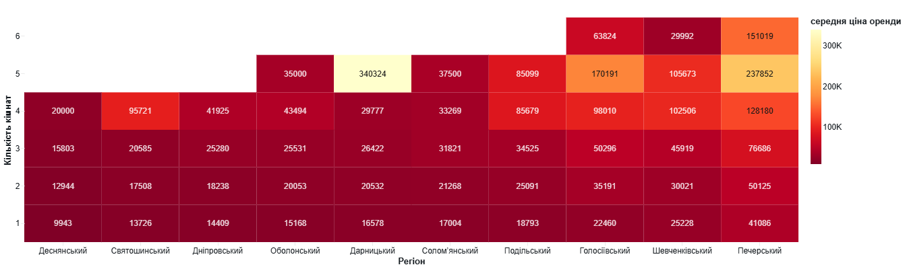

# Project Title: 'Real estate of Kyiv' datalake

## Overview
This application allows automated collection, cleaning, and analysis of Kyiv rent postings from LUN.

## Key Features

- **Data Scraping**: Parsing a data within the dynamic website
- **Storage**: Store data within AWS S3
- **Automation**: Setting up airflow DAG for data ingestion with everyday schedule
- **Analysis**: Using bid data solutions such as Apache Spark within Databricks platform for fast data cleaning and analysis
## Technologies Used

- **Python**
- **Playwright**: data scraping
- **Airflow**: schedule the workflow
- **Terraform**: manage infrastructure within AWS cloud
- **Databricks**: provides managed spark and simple data visualization

> **🔎 [Data analysis notebook available here](https://github.com/leavemeal0ne/real_estate_datalake/spark_analysis)** 
> 
